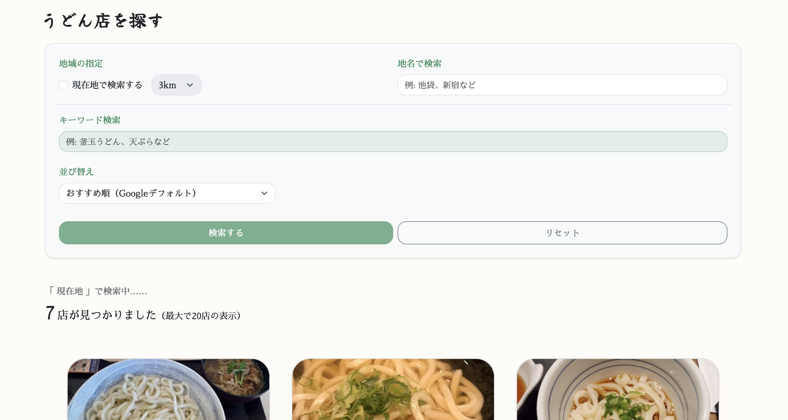
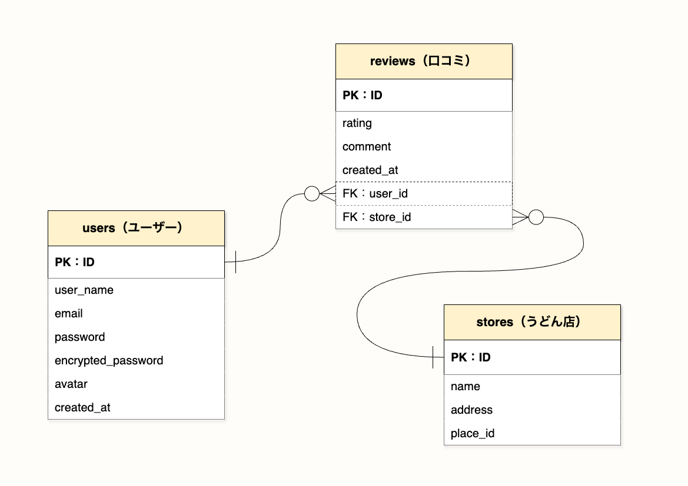

# 「最強のうどん師」 - 全国のうどん屋を検索&レビューできるグルメアプリ

## 1. サービス概要

**うどん好きによる、うどん好きのための検索&レビュー共有アプリ**

## 2. サービス画像

## 3. サービスのURL

https://saikyo-udon-186fd1caa91b.herokuapp.com/

## 4. サービスの概要

「最強のうどん師」は、全国各地のうどん屋さんを検索できたり、レビュー（口コミ）を投稿・閲覧できたりするサービスです。
Googleマップと連携しており、現在地検索や任意のキーワードで検索して、直感的な操作で口コミを投稿できるのが特長です。

## 5. 開発背景

外食レビューサイトは数多く存在しますが、「うどん」に特化したサービスは少なく、自らが情報を選別せざるを得ないことに煩わしさ感じていました。

そこで、うどん屋さん・うどんを提供するお店のみを対象とすることで、調べる工程の煩雑さを無くした検索機能を搭載しました。
さらに、口コミの投稿・閲覧機能も実装し、全国の「うどん好き」の皆様と情報を共有できる場を作りたいと思い、このアプリを開発しました。

## 6. 機能

### ホーム画面
- ファーストビュー : 検索ページへ遷移するボタンと、一発で現在地のうどん屋さんを検索できるボタンを表示 
- 東京の高評価（星4以上）うどん屋さんをランダムに4店表示
- 最新5件の口コミを一覧表示

### ユーザー機能
- Deviseを使用した新規登録・ログイン・ログアウト・ゲストログイン（ワンクリック）
- アカウントの編集・削除
- ログイン時のプロフィールページと、非ログイン時の各ユーザーページ

### 検索ページ
- **地域検索**: 現在地から200m・500m・1km・3kmの範囲を選択・地名欄にフリー入力で検索
- **キーワード検索**: キーワード欄にフリー入力で店名や店舗概要から検索
- GoogleMapAPIを使用し、検索フォームで選択・入力されたキーワードをもとに、最大20件のうどん屋さんを表示（評価順ソート可能）
- 各うどん屋さんカードをクリックすると地図つき店舗詳細ページに遷移

### 口コミ機能
- **口コミ投稿**: 評価（星を1~5選択）とコメントを入力して投稿
- **口コミ閲覧**: 店舗詳細ページ・口コミ一覧ページ・プロフィールページ・各ユーザーページにて表示
- プロフィールページで口コミを編集・削除
- 口コミ一覧ページで全ユーザーの口コミ表示（店名・コメント検索可能）
- 口コミの投稿者名をクリックすると各ユーザーページに遷移（自分の口コミの場合はプロフィールページに遷移）
- 口コミの店名をクリックすると店舗詳細ページに遷移

## 7. 主な使用技術

### フロントエンド
- HTML / CSS / JavaScript
- Bootstrap（スタイリング）

### バックエンド
- Ruby 3.3.4
- Ruby on Rails 8.0.2
- PostgreSQL（データベース）

### インフラ・開発環境
- Heroku（デプロイ）
- Git / Github（バージョン管理）

### その他
- Devise（ユーザー認証）
- Google Maps API（地図・店舗情報）
- ransack（レビュー検索）

## 8. ER図

## 9. 今後の展望
### 直近の修正予定
- UI修正
- レスポンシブ対応
- System SpecによるE2Eテスト強化

### 短期的な目標
- うどん店舗評価の絞り込み検索
- 地図上に口コミ数表示

### 中長期的な目標
- 口コミお気に入り機能
- ユーザーフォロー機能
